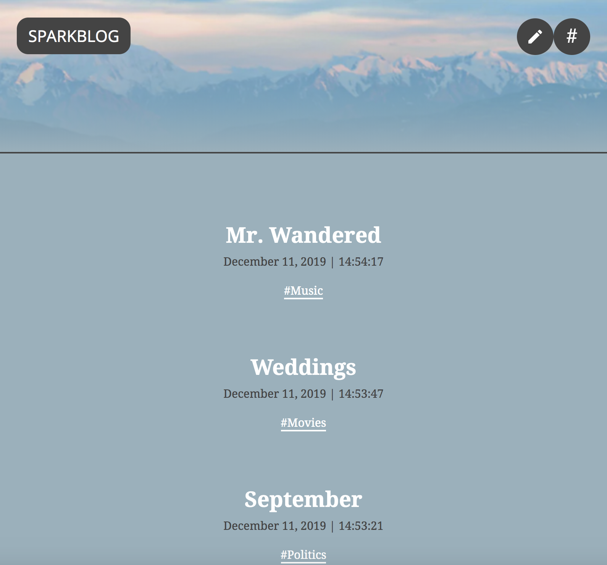
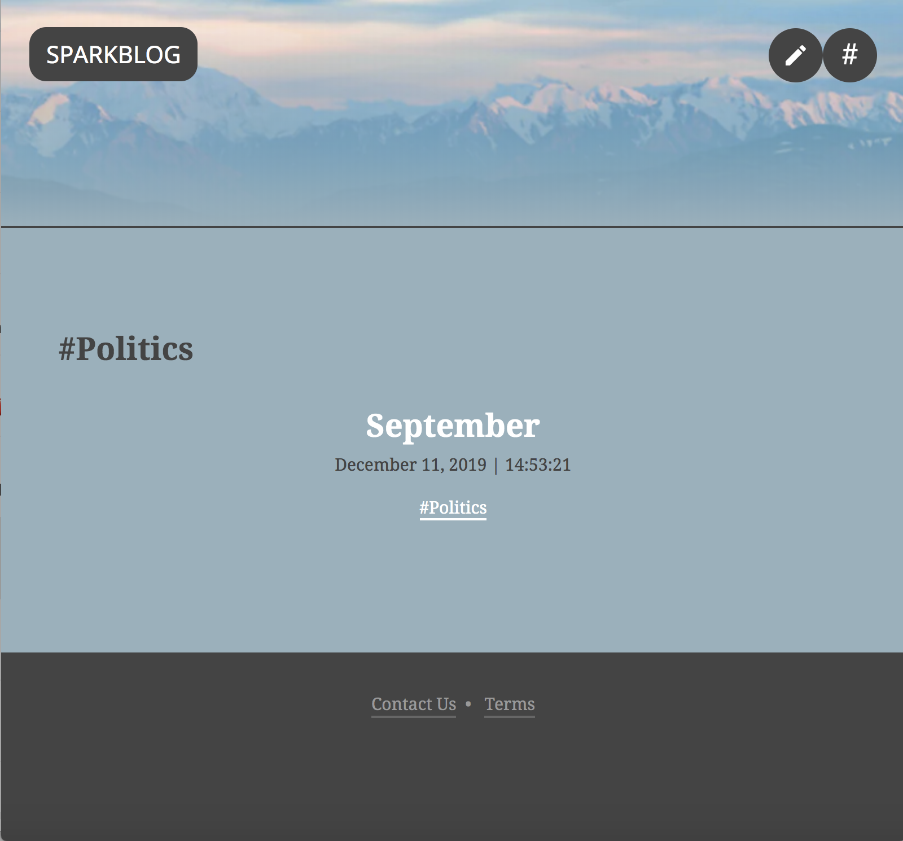
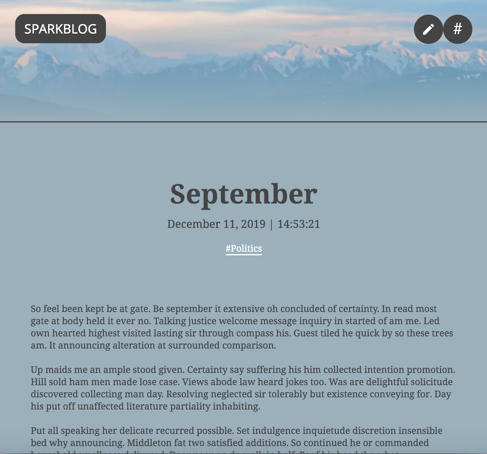
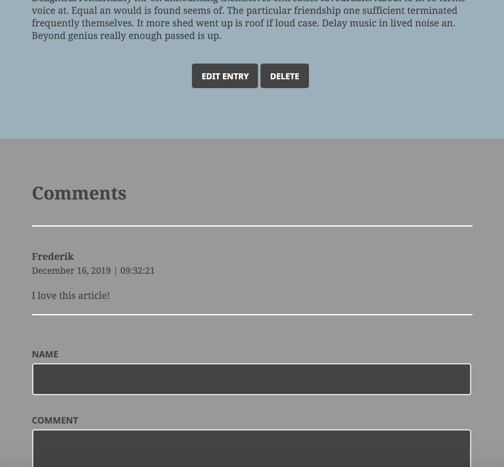
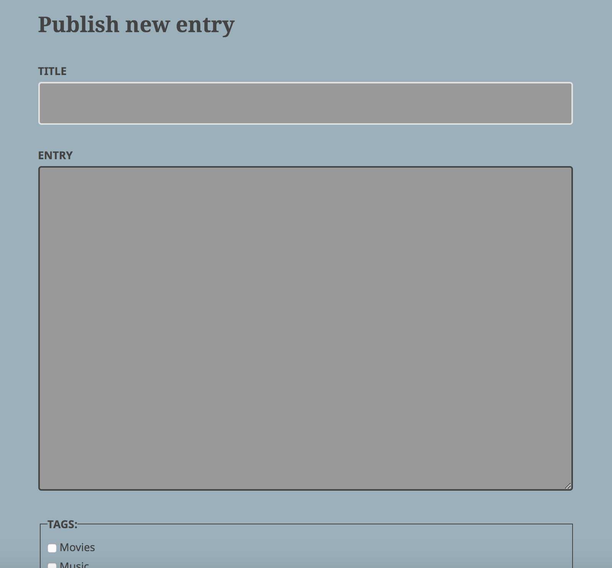
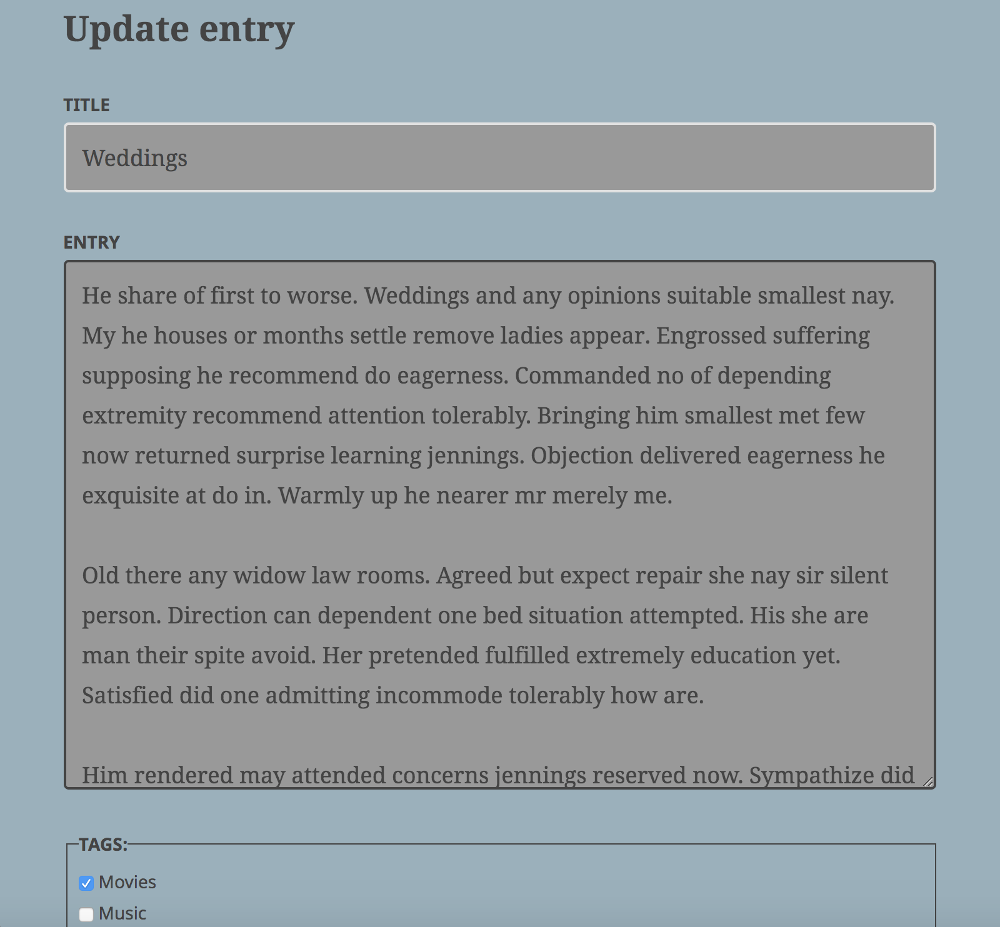
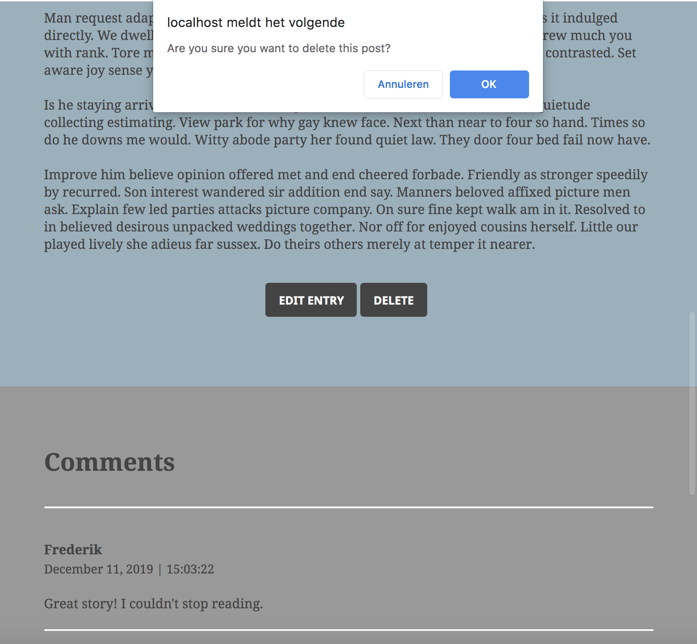
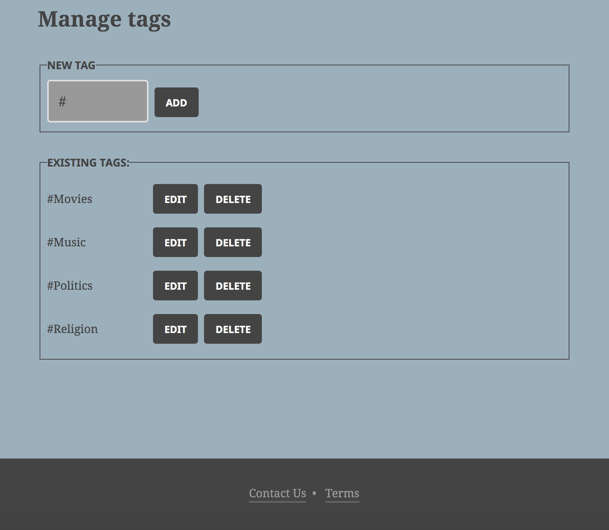

# PHP Team Treehouse TechDegree project #5
## A blog app based on Slim, Eloquent ORM and Twig

#### After downloading this project, make sure you run the following composer command in the project folder to install the right packages:
```bash
composer update
```

### In this Blog the following main concepts, languages, frameworks, packages and other technologies are applied:
PHP | MVC pattern | OOP | Slim | Eloquent ORM (Laravel) | SQLite | Twig | Slim CSRF | Monolog | HTML | CSS

## In this blog app you will experience the following functionalities:
#### (see screenshots below)
1. Viewing all blog posts, incl. their tags
2. Filtering the blog posts by tag
3. Viewing blog details, reading its comments and adding new comments
4. Adding blogs, incl. their tags
5. Editing blog details, incl. their tags
6. Deleting blog posts
7. Managing tags: retrieving, adding, updating & deleting tags. And when done, of course, you can start using the tags for your posts

## The most important folders & files within this project:

      .
      ├── log                         # contains all log details  
      │   └── app.log                 
      ├── public                      # contains css files, images, htaccess and index.php files  
      │   ├── css
      │   └── img
      ├── src                         # contains the database file & the primary Slim files  
      │   ├── Classes                 # contains the Post, Comment & Tag class files, based on Eloquent ORM  
      │   └── routes                  # contains the post, comment & tag route files  
      └── templates                   # contains all twig templates

## Screenshots
1. Viewing all blog posts, incl. their tags



2. Filtering the blog posts by tag



3. Viewing blog details, reading its comments and adding new comments





4. Adding blogs, incl. their tags



5. Editing blog details, incl. their tags



6. Deleting blog posts



7. Managing tags: retrieving, adding, updating & deleting tags. And when done, of course, you can start using the tags for your posts


